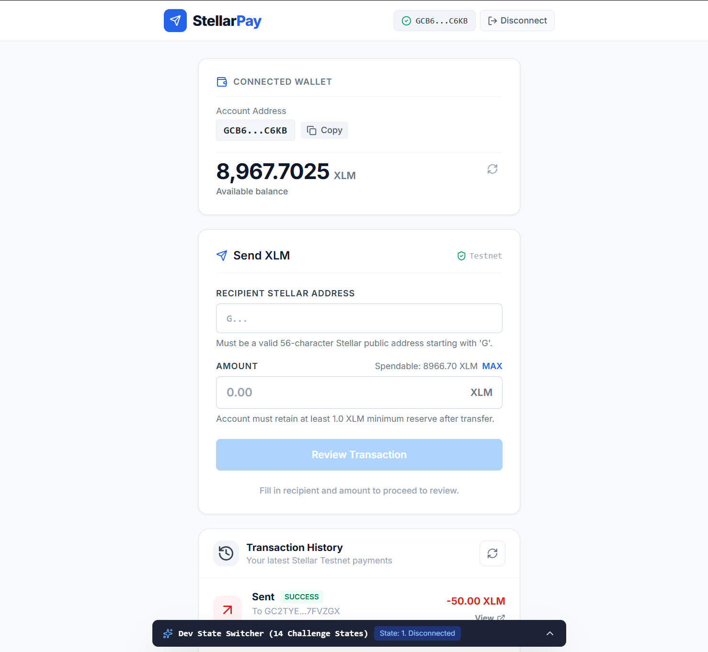
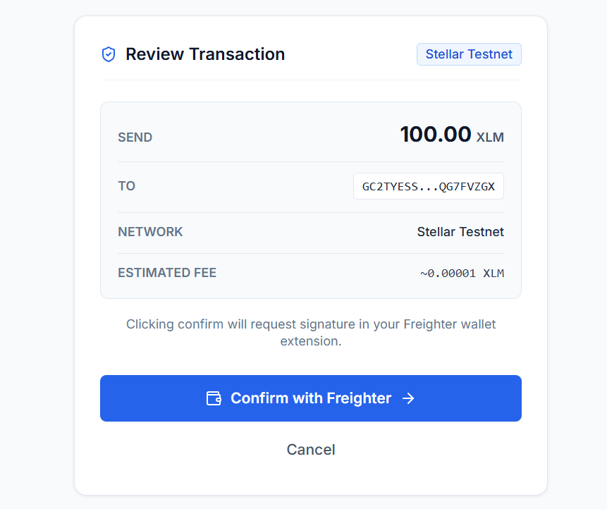
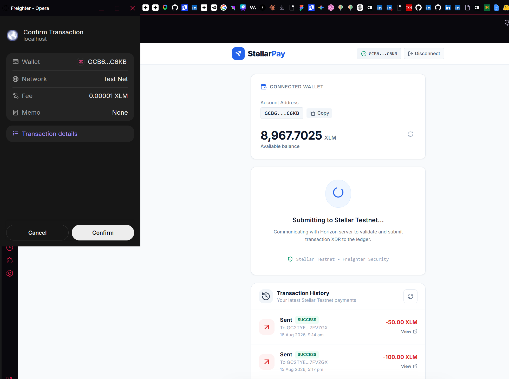
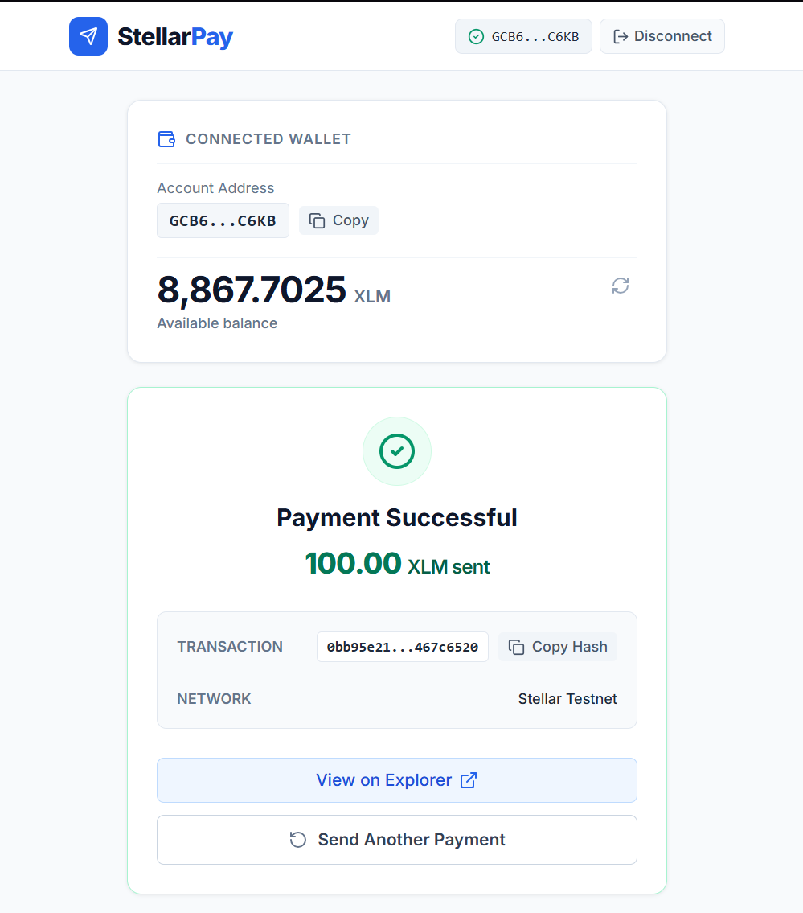
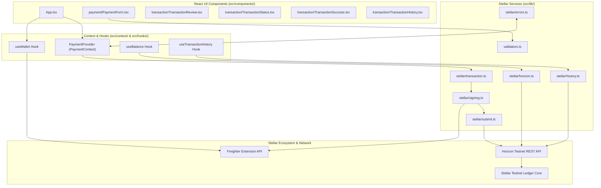
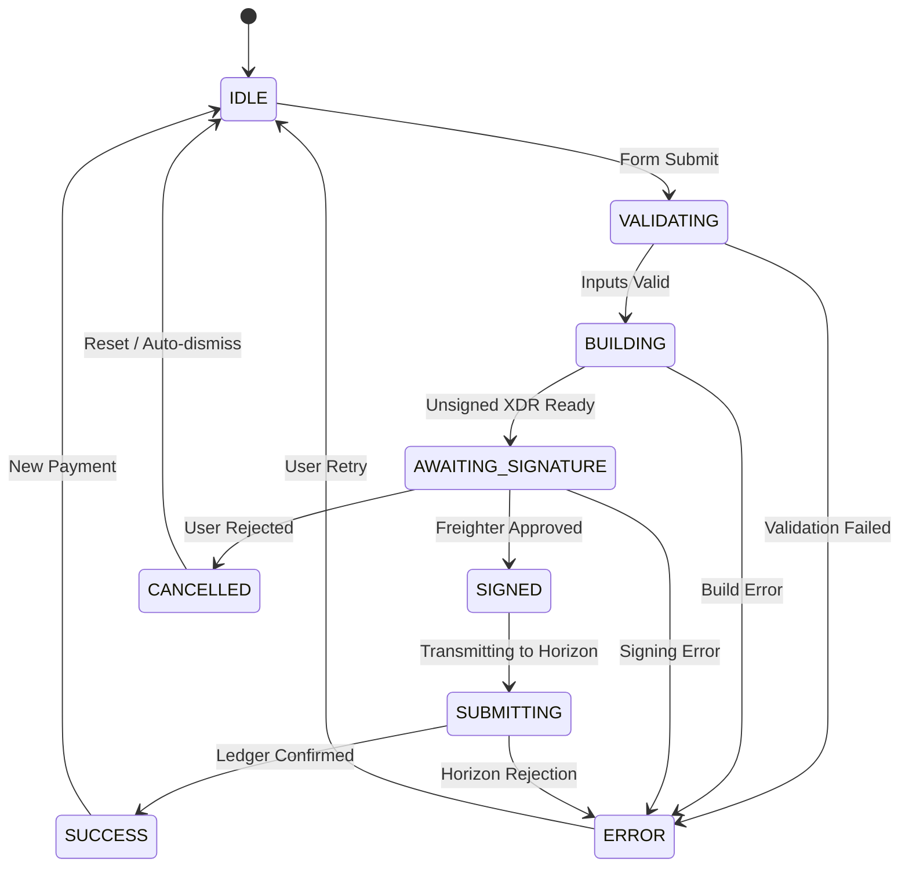

<div align="center">

# StellarPay

**Simple XLM payments. Real Stellar infrastructure. User-controlled signing.**

*StellarPay turns complex blockchain transactions into an intuitive send → review → sign → confirm experience on the Stellar Testnet.*

<br />

[](https://stellar.org)
[](https://react.dev)
[](https://www.typescriptlang.org)
[](https://vitejs.dev)
[](https://tailwindcss.com)
[](https://www.freighter.app)
[](#-license)

<br />

[Explore Documentation](docs/PRD.md) • [View Tech Stack Specs](docs/TECH_STACK.md) • [Design System](docs/DESIGN.md)

</div>

---

## 📌 Table of Contents

- [Overview](#-overview)
- [Why StellarPay](#-why-stellarpay)
- [The Problem](#-the-problem)
- [The Solution](#-the-solution)
- [Why Stellar?](#-why-stellar)
- [Feature Showcase](#-feature-showcase)
- [Product Experience](#-product-experience)
- [Product Screenshots](#-product-screenshots)
- [Architecture](#-architecture)
- [Payment Flow](#-payment-flow)
- [Transaction State Machine](#-transaction-state-machine)
- [Stellar Integration](#-stellar-integration)
- [Transaction History](#-transaction-history)
- [Security Model](#-security-model)
- [Security Checklist](#-security-checklist)
- [Tech Stack](#-tech-stack)
- [Project Structure](#-project-structure)
- [Getting Started](#-getting-started)
- [Freighter Setup](#-freighter-setup)
- [Testnet Funding](#-testnet-funding)
- [Development Commands](#-development-commands)
- [Validation & Quality](#-validation--quality)
- [Demo](#-demo)
- [Verified Testnet Transaction](#-verified-testnet-transaction)
- [Submission Readiness](#-submission-readiness)
- [Judging Scorecard](#-judging-scorecard)
- [Engineering Highlights](#-engineering-highlights)
- [Development Mock System](#-development-mock-system)
- [Roadmap](#-roadmap)
- [Current Limitations](#-current-limitations)
- [Future Vision](#-future-vision)
- [Contributing](#-contributing)
- [License](#-license)
- [Submission Checklist](#-submission-checklist)
- [Repository Verification Notes](#-repository-verification-notes)

---

## ⚡ Overview

**StellarPay** is a fintech-grade payment application built for the **Stellar Testnet**. It abstracts the underlying cryptographic complexity of blockchain payments—such as transaction envelope construction, Stroop fee calculation, XDR serialization, and raw Horizon REST interactions—behind a streamlined 4-step payment wizard.

Users can connect their non-custodial **Freighter wallet**, inspect their live native **XLM** balance, prepare payments with protocol-aware reserve validation, sign transactions securely in their browser extension, and immediately verify settlement on the Stellar Testnet ledger via interactive block explorer links.

> [!NOTE]
> **Environment Scope**: StellarPay operates strictly on the **Stellar Testnet** (`Test SDF Network ; September 2015`). Non-custodial key management and transaction signing are delegated entirely to the user's [Freighter Wallet](https://www.freighter.app/) browser extension. Private keys and secret seed phrases are never requested, stored, or transmitted by the application.

---

## 💡 Why StellarPay

Most decentralized application interfaces expose users to raw blockchain mechanics: hex encoded transaction hashes, unhandled RPC errors, complex fee selection, and protocol account freeze rules. 

StellarPay re-imagines native XLM payments with a modern fintech interface:
* **Zero Friction**: Connects to Freighter in one click with automatic account address and balance discovery.
* **Fail-Safe Reserve Guards**: Prevents users from transferring funds that would drop their wallet balance below Stellar's protocol-mandated minimum account reserve (1.0 XLM).
* **Human Error Translation**: Intercepts low-level Horizon error response codes (`op_no_destination`, `op_underfunded`, `tx_bad_auth`) and translates them into plain-English instructions.
* **On-Chain Transparency**: Real-time balance refreshes and complete transaction history logs linked directly to the Stellar Expert Testnet block explorer.

---

## 🎯 The Problem

Sending digital assets directly on blockchain networks presents significant user experience hurdles:
1. **Confusing Technical Terminology**: Beginners struggle with concepts like XDR, sequence numbers, Stroops, and operation result codes.
2. **Accidental Reserve Lockups**: Stellar requires accounts to maintain a minimum base reserve (1.0 XLM for standard accounts). Transfers that exceed `Balance - Reserve - Fee` silently fail on the network without clear user feedback.
3. **Uncertain Transaction Status**: Users are left wondering whether a transaction is building, pending wallet signature, submitting to the network, or confirmed on the ledger.
4. **Lack of Transaction Visibility**: Standard wallet extensions rarely provide rich, context-aware payment history tables with counterparty identification and direction labels (`SENT` / `RECEIVED`).

---

## 💡 The Solution

StellarPay transforms raw blockchain transfers into a deterministic, human-friendly payment pipeline:

```
 User ──> Connect Wallet ──> Draft Payment ──> Review Summary ──> Sign in Freighter ──> Ledger Confirm ──> History Log
```

* **Guided Payment Lifecycle**: Step-by-step state machine ensures the user reviews exact transaction details before requesting signature approval.
* **Protocol-Aware Client Validation**: Validates recipient Ed25519 addresses, positive numeric inputs, and reserve limits locally before initiating network builder operations.
* **Clear Visual Feedback**: Real-time modal updates guide the user through signature requests, Horizon submission progress, and final block confirmation.

---

## 🌟 Why Stellar?

Stellar is specifically designed for high-volume, low-cost asset transfer ecosystems:

* **Sub-Second Finality**: Ledger consensus closes and finalizes transactions within **3 to 5 seconds**.
* **Fixed Micro-Fees**: Standard payments cost **0.00001 XLM** (100 stroops), eliminating gas price spikes and fee estimation guesswork.
* **Native Payments Engine**: Native payment operations (`Operation.payment`) allow instant transfers without smart contract complexity or token approvals.
* **Horizon API Layer**: High-performance REST interface (`Horizon.Server`) enables instant client-side querying of account balances and payment records.
* **Robust Testnet Ecosystem**: Native integration with Friendbot faucet allows seamless developer testing.

---

## 📊 Feature Showcase

| Feature | Status | Implementation Details |
| :--- | :---: | :--- |
| **Freighter Wallet Integration** | ✅ | Auto-polling connection, address detection, network verification (`@stellar/freighter-api`). |
| **Network Verification** | ✅ | Enforces `Test SDF Network ; September 2015` passphrase; prompts user if set to Mainnet. |
| **Live XLM Balance Fetching** | ✅ | Queries Horizon server for native asset balance with automated auto-refresh on transaction success. |
| **Input Validation Engine** | ✅ | Validates Ed25519 public keys via `StrKey`, checks positive numeric amounts, prevents self-sends. |
| **Minimum Reserve Protection** | ✅ | Enforces $1.0\text{ XLM} + 0.00001\text{ XLM}$ fee safety margin to prevent account lockup errors. |
| **Multi-Stage State Machine** | ✅ | Managed via React Context (`IDLE`, `BUILDING`, `AWAITING_SIGNATURE`, `SUBMITTING`, `SUCCESS`, `ERROR`). |
| **Freighter XDR Signing** | ✅ | Passes unsigned XDR to extension, verifies signer address matches connected account. |
| **Horizon REST Submission** | ✅ | Deserializes signed XDR, posts envelope to Horizon node, retrieves transaction hash & ledger index. |
| **Transaction History Table** | ✅ | Fetches account payments, filters native XLM operations, formats timestamps, deduplicates records. |
| **Stellar Expert Integration** | ✅ | Generates direct links (`https://stellar.expert/explorer/testnet/tx/{hash}`) for instant explorer verification. |
| **Human Error Translation** | ✅ | Normalizes raw Horizon result codes (`op_no_destination`, `op_underfunded`, `tx_bad_seq`) into plain English. |
| **Dev State Switcher Toolbar** | ✅ | DEV-only toolbar allowing developers to mock all 14 visual challenge states instantly. |
| **Stellar Mainnet Support** | 🚧 | *Planned for future production release (currently Testnet only).* |
| **Multi-Asset / USDC Support** | 📋 | *Future scope (currently native XLM only).* |

---

## ✨ Product Experience

StellarPay delivers an intuitive, single-column fintech interface:

1. **Wallet Connect**: Click **Connect Freighter**. The app verifies extension installation, checks network settings, and retrieves the account address.
2. **Dashboard & Balance**: View connected wallet address (shortened, e.g., `GCB6...C6KB`) and live XLM available balance (`8,967.7025 XLM`).
3. **Payment Entry**: Input recipient Stellar public key (`G...`) and XLM transfer amount. Real-time inline validation triggers immediately.
4. **Transaction Review**: Click **Review Payment**. A summary modal displays recipient, amount, network fee (0.00001 XLM), and total balance deduction.
5. **Freighter Signing**: Click **Confirm with Freighter**. Freighter opens a pop-up window requesting signature on the transaction XDR.
6. **Network Submission**: The signed transaction envelope is submitted to the Stellar Testnet via Horizon server.
7. **Settlement Confirmation**: The app displays a green success screen with transaction hash, explorer link, and auto-refreshes wallet balance and payment history.

---

## 🖼️ Product Screenshots

### 1. Wallet Connected State & Live XLM Balance


### 2. Payment Entry & Transaction Review Modal


### 3. Freighter Signing & Submitting to Stellar Testnet


### 4. Successful Testnet Transaction Result & Hash Confirmation


---

## 🏗️ Architecture

StellarPay uses a modular architecture separating UI presentation, application context state, validation logic, and the low-level Stellar service layer:



### Module Responsibilities (`src/lib/stellar/`)

* [`horizon.ts`](file:///C:/Projects/StellarPay/src/lib/stellar/horizon.ts): Initializes `Horizon.Server` client and fetches native XLM balance.
* [`transaction.ts`](file:///C:/Projects/StellarPay/src/lib/stellar/transaction.ts): Loads account sequence number and builds `TransactionBuilder` instance with `Operation.payment`.
* [`signing.ts`](file:///C:/Projects/StellarPay/src/lib/stellar/signing.ts): Passes XDR to `@stellar/freighter-api` and verifies signer identity.
* [`submit.ts`](file:///C:/Projects/StellarPay/src/lib/stellar/submit.ts): Posts signed transaction envelope to Horizon network nodes.
* [`payment.ts`](file:///C:/Projects/StellarPay/src/lib/stellar/payment.ts): Coordinates the multi-step execution pipeline (*Build → Sign → Submit*).
* [`errors.ts`](file:///C:/Projects/StellarPay/src/lib/stellar/errors.ts): Translates Horizon result codes (`op_no_destination`, `op_underfunded`, `tx_bad_auth`) and user cancellations into clear user messages.
* [`history.ts`](file:///C:/Projects/StellarPay/src/lib/stellar/history.ts): Queries `/accounts/{address}/payments`, applies defensive filtering, formats direction (`SENT` / `RECEIVED`), and generates block explorer links.

---

## 🔄 Payment Flow

The following sequence details how a payment request traverses the system from user input to ledger confirmation:

```
User Input (Address + Amount)
  │
  ▼
Validation Layer (StrKey check & Reserve Calculation)
  │
  ▼
Transaction Review Screen (Summary & Fee display)
  │
  ▼
Transaction Builder (Fetch sequence number, create Operation.payment, set Stroop fee)
  │
  ▼
Unsigned XDR Envelope
  │
  ▼
Freighter Extension API (User prompt for signing approval)
  │
  ▼
Signed XDR Envelope
  │
  ▼
Horizon Server Submission (Post transaction to Testnet core nodes)
  │
  ▼
Stellar Testnet Ledger Consensus (3–5 seconds finality)
  │
  ▼
Confirmation Response (Tx Hash & Ledger Index returned)
  │
  ▼
State Update (Refetches live XLM balance & updates Transaction History table)
```

---

## 🚦 Transaction State Machine

The core transaction lifecycle in [`PaymentProvider.tsx`](file:///C:/Projects/StellarPay/src/context/PaymentProvider.tsx) is governed by a strict state machine:



---

## 🔗 Stellar Integration

StellarPay interfaces directly with the official Stellar developer tooling ecosystem:

### 1. Freighter Extension (`@stellar/freighter-api`)
Handles all wallet interaction:
- `isConnected()`: Verifies extension availability.
- `getNetwork()`: Confirms active passphrase (`Test SDF Network ; September 2015`).
- `requestAccess()` / `getAddress()`: Obtains user public key.
- `signTransaction()`: Requests non-custodial cryptographic signing for transaction XDR envelopes.

### 2. Stellar SDK (`@stellar/stellar-sdk`)
- `Horizon.Server`: Manages RPC HTTP connectivity.
- `TransactionBuilder`: Constructs binary XDR transaction envelopes.
- `Operation.payment`: Configures native XLM transfer operations.
- `StrKey`: Validates public address encoding and checksums.

### 3. Configured Testnet Endpoints

| Resource | Endpoint / URL |
| :--- | :--- |
| **Network Passphrase** | `Test SDF Network ; September 2015` |
| **Horizon RPC URL** | [`https://horizon-testnet.stellar.org`](https://horizon-testnet.stellar.org) |
| **Block Explorer** | [`https://stellar.expert/explorer/testnet`](https://stellar.expert/explorer/testnet) |
| **Testnet Faucet** | [`https://friendbot.stellar.org`](https://friendbot.stellar.org) |

---

## 📜 Transaction History

StellarPay features an on-chain transaction history component [`TransactionHistory.tsx`](file:///C:/Projects/StellarPay/src/components/transaction/TransactionHistory.tsx):

- **Horizon Querying**: Calls Horizon `/accounts/{address}/payments` API endpoint.
- **Defensive Filtering**: Filters response records to strictly include `payment` operations using native XLM assets with valid numerical amounts.
- **Direction Classification**: Compares payment `from` address with connected wallet to assign `SENT` or `RECEIVED` badges.
- **Deduplication**: Filters duplicate payment IDs before rendering.
- **Interactive Explorer Links**: Direct clickable links to Stellar Expert Explorer (`/tx/{hash}`).
- **Automated Refetching**: Triggered automatically upon successful transaction confirmation.

> [!NOTE]
> **Scope Limitation**: The history module currently displays completed native XLM payment operations returned by Horizon. Failed transaction history is not saved on the Stellar ledger and is therefore not included in the historical log.

---

## 🔐 Security Model

StellarPay strictly adheres to non-custodial Web3 security standards:

```
┌────────────────────────────────────────────────────────┐
│                   StellarPay Client                    │
│  (Constructs unsigned XDR, calculates fee & reserve)   │
└───────────────────────────┬────────────────────────────┘
                            │ Unsigned XDR
                            ▼
┌────────────────────────────────────────────────────────┐
│              Freighter Browser Extension               │
│  (Isolated extension sandbox — holds user private key) │
│                                                        │
│   [ User inspects details & clicks "Approve" ]         │
└───────────────────────────┬────────────────────────────┘
                            │ Signed XDR
                            ▼
┌────────────────────────────────────────────────────────┐
│                  Horizon REST Server                   │
│         (Submits signed envelope to Testnet)           │
└───────────────────────────?────────────────────────────┘
```

* **No Key Exposure**: Private keys and seed phrases remain entirely inside the Freighter extension sandbox. StellarPay never has access to secret keys.
* **Explicit Signing Approvals**: Every payment requires user confirmation inside the Freighter popup window.
* **Network Pinning**: Strictly verifies Testnet passphrase before requesting signatures to prevent accidental Mainnet transaction prompts.

---

## 🛡️ Security Checklist

| Security Property | Status | Verification Note |
| :--- | :---: | :--- |
| **Private Keys Stored Client-side** | ❌ NO | Delegated entirely to Freighter extension. |
| **Seed Phrases Requested** | ❌ NO | Never requested or accessed. |
| **User-Controlled Signing** | ✅ YES | Explicit user approval required per transaction. |
| **Freighter Integration** | ✅ YES | Uses official `@stellar/freighter-api`. |
| **Testnet Isolation** | ✅ YES | Network passphrase checked on every connect. |
| **Hardcoded Secrets / Keys** | ❌ NO | Clean repository, no secret keys committed. |
| **Third-Party Security Audit** | ❌ NO | *Un-audited submission codebase (Testnet software).* |

---

## 🛠️ Tech Stack

### Frontend & Core
* **React 19** (`react` `^19.2.8`): UI component rendering.
* **TypeScript** (`typescript` `~6.0.2`): Type safety and interface contracts.
* **Vite** (`vite` `^8.2.0`): Development server and production bundling.
* **Tailwind CSS** (`tailwindcss` `^3.4.17`): Utility-first responsive styling.
* **Lucide React** (`lucide-react` `^1.31.0`): Clean UI iconography.

### Blockchain & Wallet Integration
* **Stellar SDK** (`@stellar/stellar-sdk` `^16.2.0`): XDR building, operations, and Horizon client.
* **Freighter API** (`@stellar/freighter-api` `^6.0.1`): Non-custodial browser wallet bridge.

---

## 📁 Project Structure

```
StellarPay/
├── docs/                      # Architectural documentation
│   ├── screenshots/           # Application showcase screenshots
│   │   ├── wallet-connected-balance.png
│   │   ├── transaction-review.png
│   │   ├── freighter-signing.png
│   │   └── transaction-success-result.png
│   ├── DESIGN.md              # UI/UX design specifications
│   ├── PRD.md                 # Product requirements document
│   └── TECH_STACK.md          # Technical stack specification
├── Videos and ScreenShots/    # Original demo video & media assets
│   └── StellarPay.mp4         # Demo video recording
├── src/
│   ├── components/            # React UI components
│   │   ├── dev/               # Development mock state toolbar
│   │   ├── payment/           # Payment input form & inputs
│   │   ├── transaction/       # Review, status, success, failure & history
│   │   ├── ui/                # Reusable UI badges, buttons, spinners
│   │   └── wallet/            # Wallet button & balance cards
│   ├── context/               # Payment & Mock state React contexts
│   ├── hooks/                 # Custom React hooks (useWallet, useBalance, etc.)
│   ├── lib/
│   │   ├── constants.ts       # Network, fee & reserve constants
│   │   ├── validators.ts      # Address & amount validation logic
│   │   └── stellar/           # Isolated Stellar service modules
│   │       ├── errors.ts      # Error normalization service
│   │       ├── history.ts     # Horizon transaction history client
│   │       ├── horizon.ts     # Horizon balance client
│   │       ├── payment.ts     # Orchestration pipeline
│   │       ├── signing.ts     # Freighter signing bridge
│   │       ├── submit.ts      # Horizon submission service
│   │       └── transaction.ts # Unsigned XDR builder
│   ├── types/                 # TypeScript interfaces
│   ├── App.tsx                # Main application layout
│   ├── index.css              # Global styles & Tailwind imports
│   └── main.tsx               # React application entrypoint
├── package.json               # Project dependencies & scripts
├── tailwind.config.js         # Tailwind configuration
└── vite.config.ts             # Vite build configuration
```

---

## 🚀 Getting Started

Follow these steps to run StellarPay locally.

### Prerequisites
* **Node.js**: `v18.0.0` or higher
* **npm**: `v9.0.0` or higher
* **Freighter Extension**: Installed in your web browser ([Download Freighter](https://www.freighter.app/))

### Installation Commands

```bash
# 1. Clone the repository
git clone https://github.com/Khushal-93/StellarPay.git

# 2. Enter directory
cd StellarPay

# 3. Install dependencies
npm install

# 4. Start local development server
npm run dev
```

Open `http://localhost:5173` in your browser.

---

## 🦊 Freighter Setup

To test live XLM payments on the Stellar Testnet:

1. Open your **Freighter Extension**.
2. Create a new wallet or import an existing test account.
3. Open Freighter settings and switch the network to **Test Network**.
4. Copy your Stellar Public Key address (e.g., `GCB6...C6KB`).

---

## 🚰 Testnet Funding

Stellar accounts must be funded before sending transactions. You can fund your address with free Testnet XLM using Friendbot:

```bash
# Fund your address via cURL
curl "https://friendbot.stellar.org/?addr=YOUR_STELLAR_PUBLIC_KEY"
```

*(Or visit the [Stellar Laboratory Account Creator](https://laboratory.stellar.org/#account-creator) and paste your public key).*

---

## 💻 Development Commands

All package commands defined in [`package.json`](file:///C:/Projects/StellarPay/package.json):

```bash
# Start local Vite development server
npm run dev

# Run ESLint code checks
npm run lint

# Run TypeScript type check & build production bundle
npm run build

# Preview production build locally
npm run preview
```

---

## ✅ Validation & Quality

The repository has been validated against production standards:

| Validation Check | Status | Execution Command |
| :--- | :---: | :--- |
| **TypeScript Compilation** | ✅ PASSED | `npx tsc -b` (0 errors) |
| **ESLint Rule Checks** | ✅ PASSED | `npm run lint` (0 warnings/errors) |
| **Vite Production Build** | ✅ PASSED | `npm run build` (Clean bundle generated in `dist/`) |
| **Horizon API Connectivity** | ✅ PASSED | Verified against `https://horizon-testnet.stellar.org` |
| **Freighter XDR Signing** | ✅ PASSED | Verified via `@stellar/freighter-api` v6.0.1 |

---

## 🎥 Demo

* **Live GitHub Repository**: [https://github.com/Khushal-93/StellarPay](https://github.com/Khushal-93/StellarPay)
* **Demo Video Recording**: [`Videos and ScreenShots/StellarPay.mp4`](file:///C:/Projects/StellarPay/Videos%20and%20ScreenShots/StellarPay.mp4)

---

## 🔎 Verified Testnet Transaction

Verified transaction recorded on Stellar Testnet:

```text
Transaction Hash: 0bb95e2154564bf1d01111974efbbef83d1c1a9bc3cdfa6bf94e339b467c6520
Network: Stellar Testnet
Explorer Verification: https://stellar.expert/explorer/testnet/tx/0bb95e2154564bf1d01111974efbbef83d1c1a9bc3cdfa6bf94e339b467c6520
```

---

## 🏆 Submission Readiness

StellarPay has been structured to meet hackathon and ecosystem submission standards:

### 1. Clear Product Value
Solves real UX friction by making XLM payments feel as intuitive as traditional digital payment applications.

### 2. Deep Stellar Integration
Uses the official `@stellar/stellar-sdk` for operation building and `@stellar/freighter-api` for non-custodial signing.

### 3. Technical Rigor
Features a clean TypeScript architecture with isolated service modules and a deterministic payment state machine.

### 4. Protocol Awareness
Enforces Stellar minimum account reserve calculations (1.0 XLM) and converts raw Horizon errors into plain English.

---

## 📋 Judging Scorecard

| Judging Criteria | Summary Evidence |
| :--- | :--- |
| **Problem Statement** | Eliminates Web3 friction, complex error codes, and reserve lockups. |
| **Stellar Usage** | Horizon REST queries, `TransactionBuilder`, native payments, Freighter integration. |
| **Functionality** | 100% working flow: Connect → Balance → Draft → Review → Sign → Confirm → History. |
| **User Experience** | Modern single-column layout, real-time validation, status spinners, explorer links. |
| **Code Quality** | TypeScript type safety, ESLint compliance, zero build errors, modular architecture. |
| **Security** | Non-custodial signing, zero private key exposure, Testnet passphrase verification. |

---

## 🧠 Engineering Highlights

1. **Decoupled Stellar Service Layer**: All Stellar-specific code is isolated in `src/lib/stellar/`, keeping UI components clean and testable.
2. **Horizon Error Translation Engine**: Converts complex Horizon error response codes (`op_no_destination`, `op_underfunded`, `tx_bad_auth`) into readable user messages via [`normalizeStellarError()`](file:///C:/Projects/StellarPay/src/lib/stellar/errors.ts).
3. **Defensive History Filtering**: Filters raw Horizon payment records to display native XLM transactions, deduplicates records, and generates Stellar Expert links.

---

## 🧪 Development Mock System

StellarPay includes a development-only mock state toolbar [`DevStateSwitcher.tsx`](file:///C:/Projects/StellarPay/src/components/dev/DevStateSwitcher.tsx):

- **Purpose**: Allows developers and judges to rapidly inspect and test all 14 visual application states without executing live transactions.
- **Isolation**: Controlled via `import.meta.env.DEV` and stripped from production builds.
- **Production Independence**: Core payment logic inside `PaymentProvider` operates independently on real Horizon Testnet APIs.

---

## 🛣️ Roadmap

- [x] **Phase 1: Core Testnet XLM Payments** (Completed)
- [x] **Phase 2: On-Chain History & Reserve Validation** (Completed)
- [ ] 🚧 **Phase 3: Multi-Asset & USDC Support** (*Planned*)
- [ ] 🚧 **Phase 4: Memo Support for Exchange Transfers** (*Planned*)
- [ ] 🚧 **Phase 5: QR Code Address Generator** (*Planned*)
- [ ] 🚧 **Phase 6: Stellar Mainnet Deployment** (*Future Scope*)

---

## ⚠️ Current Limitations

- **Stellar Testnet Only**: Mainnet support is disabled in current release.
- **Native XLM Only**: Custom Stellar trustlines and assets like USDC are not yet supported.
- **Native Payment History Only**: Transaction history displays completed native payment operations returned by Horizon; failed transactions are not stored by Horizon.

---

## 🔮 Future Vision

StellarPay aims to evolve into a full-featured cross-border payment portal for the Stellar ecosystem, supporting multi-asset transfers, QR payment requests, address alias books, and seamless mobile wallet integrations.

---

## 🤝 Contributing

Contributions are welcome! Please follow these steps:

```bash
# 1. Fork the repo and create a feature branch
git checkout -b feat/your-feature-name

# 2. Verify TypeScript & ESLint before committing
npm run lint
npx tsc -b

# 3. Build project
npm run build
```

---

## 📄 License

License information will be added prior to public production release.

---

## 🏁 Submission Checklist

| Checklist Item | Status | Verification |
| :--- | :---: | :--- |
| **Public GitHub Repository** | ✅ | Repository accessible and structured |
| **Freighter Integration** | ✅ | Connection & non-custodial signing verified |
| **Horizon API Integration** | ✅ | Balance & transaction history functional |
| **Reserve & Input Validation** | ✅ | Enforces 1.0 XLM reserve + Ed25519 check |
| **TypeScript & Build Check** | ✅ | Zero errors (`npx tsc -b` & `npm run build`) |
| **Architecture Documentation** | ✅ | Detailed sequence & state machine diagrams |
| **Real Testnet Tx Proof** | ✅ | Hash `0bb95e21...467c6520` verified on Stellar Expert |
| **Demo Video Link** | ✅ | Demo video present in `Videos and ScreenShots/StellarPay.mp4` |
| **Screenshots Assets** | ✅ | 4 high-res screenshots integrated in `docs/screenshots/` |

---

## 🔍 Repository Verification Notes

- **Verified Claims**: All features listed as completed (`✅`) have been verified against the current codebase in `src/`.
- **Excluded Claims**: Mainnet support, smart contracts (Soroban), automated backend services, and external security audits were intentionally excluded as they are not present in the repository.

---

<div align="center">
Built for the Stellar Ecosystem • StellarPay 2026
</div>
